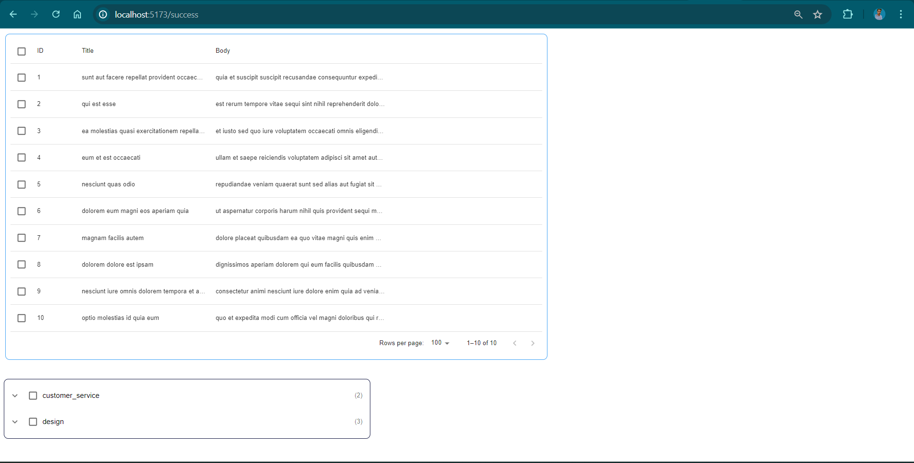
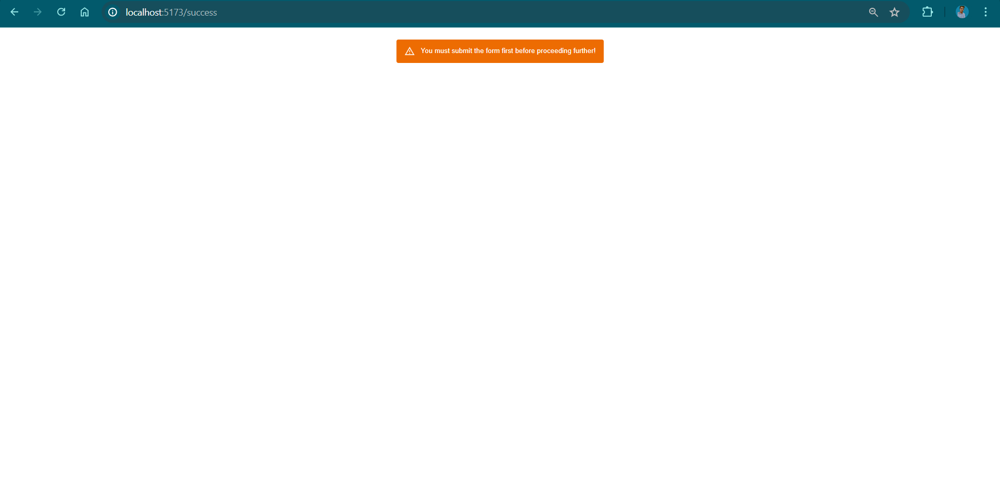

# React + TypeScript + Vite

#page-1 / Home page

#-----------Page-2--------

#-----------redirect and form submission message--------

#-----------Local storage--------

- [@vitejs/plugin-react](https://github.com/vitejs/vite-plugin-react/blob/main/packages/plugin-react/README.md) uses [Babel](https://babeljs.io/) for Fast Refresh
- [@vitejs/plugin-react-swc](https://github.com/vitejs/vite-plugin-react-swc) uses [SWC](https://swc.rs/) for Fast Refresh

